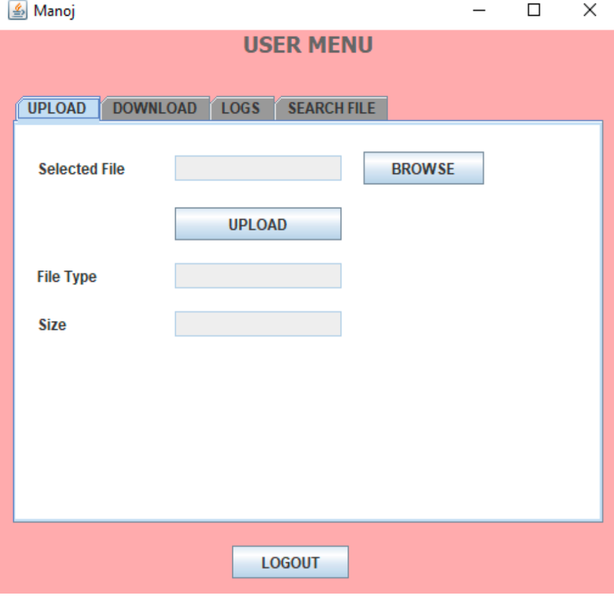
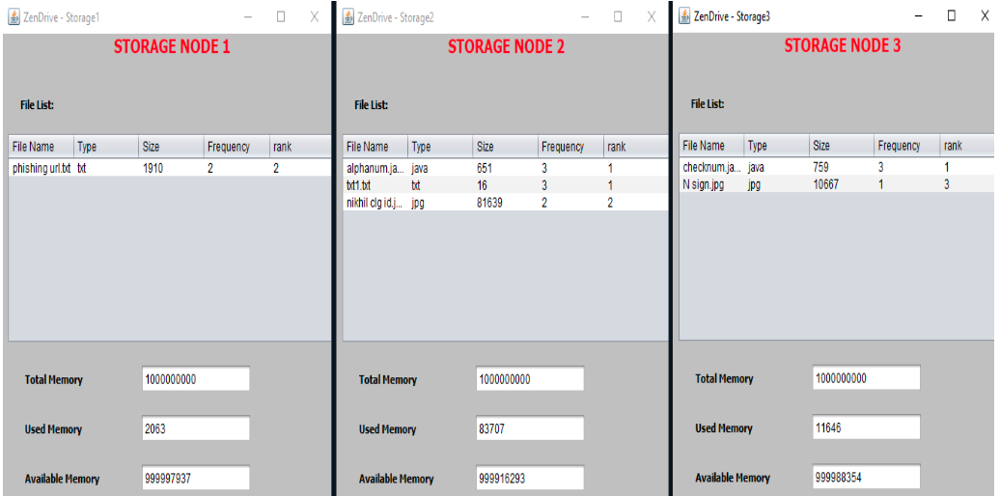
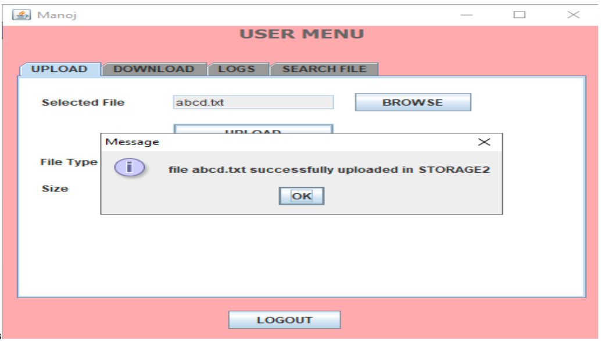
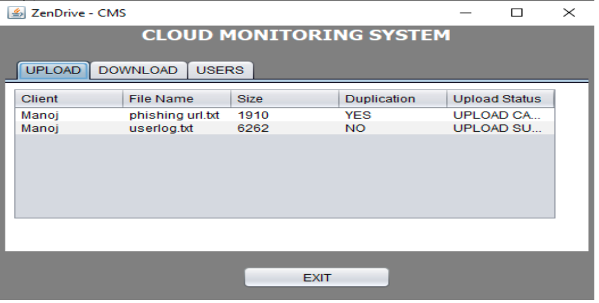
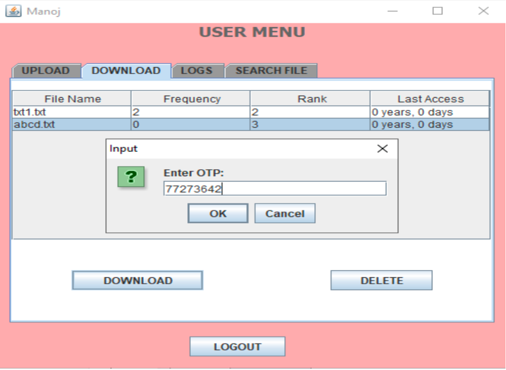
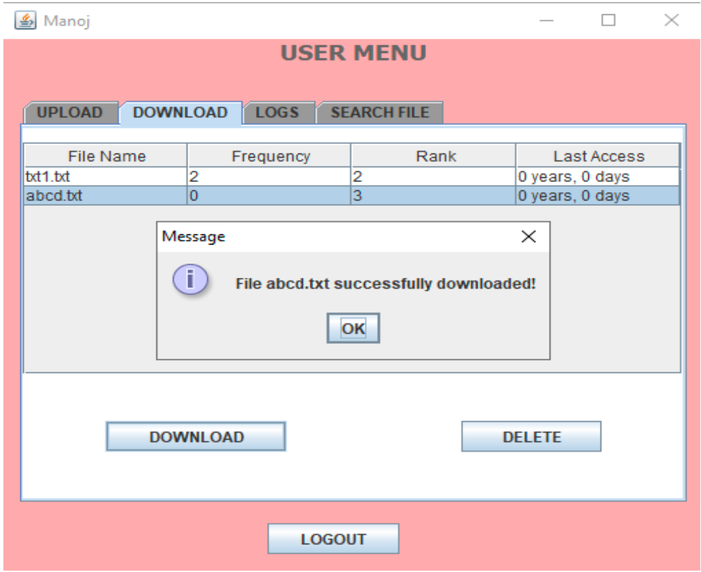

# 💾 ZenDrive – Cloud File Management System

ZenDrive is a Java-based distributed file handling system offering secure, scalable, and deduplicated cloud file storage. It includes multiple storage nodes, a central management system, login module, and a user-friendly Swing-based UI. The project uses encryption, file ranking, and compression for optimal performance and storage efficiency.

---

## 📌 Features

- 🔒 DES Encryption & MFA Login
- 📦 File Deduplication
- 📊 File Ranking System (based on access frequency)
- 📤 Secure File Upload, Download, Delete
- 🧠 Storage Node Selection by Free Memory
- 📑 OTP-Based Authentication & Email Notifications
- 📁 File Compression & Decompression
- 🛠️ Admin Logs, Validation, and Error Handling

---

## 🧰 Tech Stack & Requirements

### 📌 Frontend:
- Java Swing (GUI)
- Java AWT

### 🖥️ Backend:
- Java SE (JDK 8+)
- MySQL (5.0+)
- DES Encryption
- File Compression (ZIP)

### 🧪 Tools:
- NetBeans IDE 8.0+
- HeidiSQL (for database management)

### 🖥️ Minimum System Requirements:
- Processor: 1.8 GHz or above
- RAM: 2 GB
- HDD: 20 GB free space
- OS: Windows 7/10

---

## 🏗️ Project Modules

```bash
├── cms.java           # Cloud Management System
├── login.java         # Login & OTP verification
├── storage1.java      # Storage Node 1
├── storage2.java      # Storage Node 2
├── storage3.java      # Storage Node 3
├── assets/            # Screenshots folder
```

## ⚙️ Setup Instructions

### 1️⃣ Clone the Repository

```bash
git clone https://github.com/your-username/zendrive-secure-storage.git
cd zendrive-secure-storage
```

## Configure the Database
- Open HeidiSQL
- Create a new database named: zendrive
- Run the provided SQL script (if available) to create required tables

## Import Project in NetBeans
- Launch NetBeans IDE
- Open the project folder as an existing Java application
- Clean and Build the project

Run the Modules
Each Java file can be executed individually using NetBeans or from the terminal.

➤ Start Storage Nodes
```bash
Run storage1.java
Run storage2.java
Run storage3.java
```

➤ Start Central Manager
```bash
Run cms.java
```

## Start Login Module
```bash
Run login.java
```

## 📸 Screenshots

          
          
          
          
          
          
          
          
          
         
         
